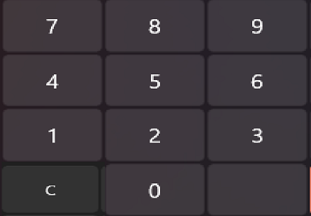

Используя GridView, создать 
1. клавиатуру калькулатора
2. строку Text над ней, в которую будет вводиться число
3. Максимальная длина - 10 символов
4. Кнопкой С можно удалять число

Приблизительно так должно получиться: 

Размеры клавиатуры, форма кнопок, цвета, шрифты - на ваше усмотрение.