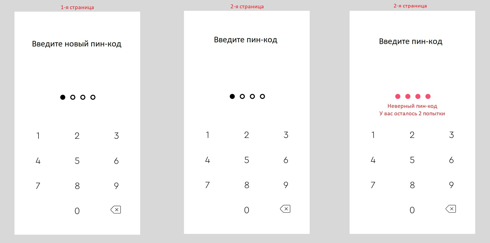

# Provider (Сброс пин-кода)
### Создайте flow для смены пин-кода, используя ChangeNotifierProvider:
1. При открытии приложения - на экране страница (1) с предложением ввести новый пин-код.
   * Возьмите свою клавиатуру из задания 3 
   * Сверстайте страницу (1) из приложенной картнки. Дизайн вольный, но красота приветствуется ;) 
   * При введении цифр с клавиатуры, "выколотая точка" закрашивается. 
   *После введения 4-ой цифры мы переходим на другую страницу (Navigator.push()):
2. Страница (0)
   * На странице одна большая кнопка "Сменить пин-код". Дизайн вольный.
   * При нажатии на "Сменить пин-код" переходим на страницу (1)
3. Страница (2)
   * Вводим тут "рабочий" пин-код
   * После введения 4-ой цифры происходит проверка пин-кода.
   * Если пин-код неправильный, точки становятся красными, под ними появляется уведомление об оставшихся попытках (изначально их всего 3). пример на рис (2)
   * После нажатия на любую клавишу клавиатуры, ввод начинается сначала, количество попыток уменьшается
   * Если за 3 попытки не ввели правильный пин-код, переходим к пункту 2.
   * Сменить пин-код без введения старого невозможно. Толкьо презапуск приложения. :)
   * Если мы ввели правильный пин-код переходим на страницу (1)

